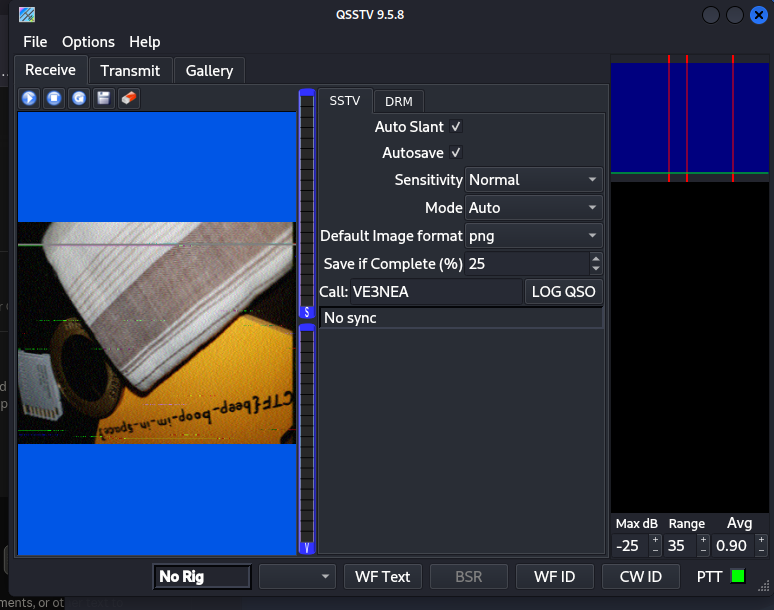

# m00nwalk

**Category:** Forensics  
**Difficulty:** Medium  
**Platform:** picoCTF 2019  
**Author:** Joon  
**Tools:** QSSTV, PulseAudio (pactl, pavucontrol)  

## Challenge Description
Decode a message (`message.wav`) from the moon.

## Recon
The provided `message.wav` file was downloaded. Playing the file revealed an unusual,
warbling sound — characteristic of an analog signal rather than normal speech or music.

The challenge's hint ("a message from the moon") points toward the Apollo 11 mission —
specifically, how images were transmitted from the moon back to Earth. The answer is
**SSTV (Slow-Scan Television)**, an analog protocol used to encode images as audio,
historically used in early space transmissions and still popular in amateur radio.

## Vulnerability / Concept
This challenge isn't based on a vulnerability in the classic sense, but on correctly
identifying the data format. The `.wav` file doesn't contain audio meant for listening —
it contains an SSTV-encoded image. To extract the image, the audio needs to be fed into
an SSTV decoder in real time, as if it were being received live over radio.

## Exploit / Solution
1. Installed **QSSTV**, a tool for encoding/decoding SSTV signals.
2. Since QSSTV expects a live audio input (like a microphone or radio feed) rather than
   a file directly, a virtual audio cable was created to route `message.wav` playback
   into QSSTV as if it were a live signal:

   ```bash
   pactl load-module module-null-sink sink_name=virtual-cable
   ```

   This creates a virtual sink (`virtual-cable`) acting as a bridge between the audio
   output (the wav file playback) and the audio input (QSSTV's recording).

3. In **pavucontrol**, under the *Recording* tab, the input source was set to the
   `virtual-cable` monitor, so QSSTV would "listen" to that virtual channel.

4. In **QSSTV** settings:
   - Input/Output: `PulseAudio Sound Server`
   - `Auto Slant`: enabled
   - `Mode`: `Auto`

5. `message.wav` was played back through the system (output routed to `virtual-cable`),
   while QSSTV was set to Receive mode, capturing the signal and rendering the image
   line by line in real time.

   `paplay -d virtual-cable message.wav`

7. Once decoding completed, the flag was visible directly on the rendered image:

   ```
   picoCTF{beep_boop_im_in_space}
   ```



## Lessons Learned
- SSTV is an analog protocol that encodes images as audio signals — used in amateur
  radio and historically for transmitting images during the Apollo missions.
- Tools like QSSTV expect a "live" audio input, so decoding a file requires simulating
  that input via a virtual audio device (`pactl` + `pavucontrol`) instead of loading
  the file directly.
- PulseAudio's `module-null-sink` is a generally useful trick for routing one
  application's audio output into another application's input.
- When a challenge mentions "how images were sent from the moon," that's a strong hint
  pointing toward SSTV.
