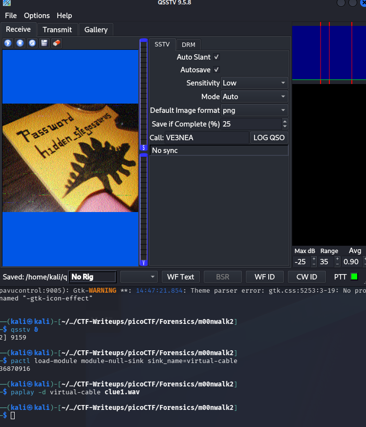
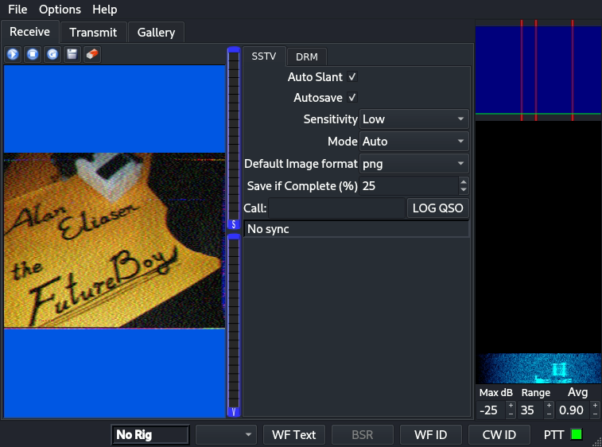

# m00nwalk2

**Category:** Forensics  
**Difficulty:** Hard  
**Platform:** picoCTF 2019  
**Author:** Joon  
**Tools:** QSSTV, PulseAudio (pactl, paplay), steghide  

## Challenge Description
Revisit the last transmission. We believe this transmission (`message.wav`) contains a
hidden message. There are also three clues: `clue1.wav`, `clue2.wav`, `clue3.wav`.

Hint: Use the clues to extract another flag from the `.wav` file.

## Recon
This challenge builds directly on **m00nwalk**, reusing the same SSTV decoding pipeline
(QSSTV + a virtual PulseAudio sink). Each of the three clue files was decoded the same
way as before, to see what information they were hiding:

1. **clue1.wav** — decoded to an image reading *"Password hidden_stegosaurus"*, clearly
   hinting at a password to be used later in the challenge.
2. **clue2.wav** — decoded to an image containing the phrase *"the quieter you are the
   more you can hear"*. The image was partially cut off during rendering, but the phrase
   was fully legible. This is a well-known reference/quote often associated with
   steganography and audio analysis communities.
3. **clue3.wav** — decoded to an image reading *"Alan Eliasen the FutureBoy"*.

Searching this name led to **Alan Eliasen ("the FutureBoy")**, who is known for his work
with **steghide**, a steganography tool for hiding data inside image and audio files.
Combined with the phrase from clue 2 ("the quieter you are, the more you can hear"), this
strongly pointed toward audio-based steganography rather than another round of SSTV
decoding.

## Investigation
Initially, `message.wav` was run through the same QSSTV/SSTV decoding process used for
the original m00nwalk challenge, but this produced no usable image or flag — a dead end,
confirming that the flag wasn't hidden in the SSTV signal itself this time.

Putting the three clues together:
- **clue3** → tool to use: `steghide`
- **clue2** → conceptual hint about listening/hiding data in audio
- **clue1** → the password needed to extract the hidden payload: `hidden_stegosaurus`




## Exploit / Extraction
With the tool and password identified, `steghide` was used directly against the original
`message.wav` file:

```bash
steghide extract -sf message.wav -p hidden_stegosaurus
```

This successfully extracted a hidden payload:

```
wrote extracted data to "steganopayload12154.txt".
```

Reading the extracted file revealed the flag:

```bash
cat steganopayload12154.txt
```

```
picoCTF{the_answer_lies_hidden_in_plain_sight}
```

## Lessons Learned
- Not every audio-based forensics challenge is solved with the same technique — this one
  deliberately reused the SSTV setup from m00nwalk as a red herring/dead end for the main
  file, while the real technique (steghide) was only discoverable through the clue files.
- `steghide` can embed data inside `.wav` files, not just images — worth trying whenever
  a password or steganography reference turns up in a forensics challenge involving audio.
- Clue files in multi-part challenges often each carry one piece of the puzzle (tool,
  password, conceptual hint) rather than the full solution — all three had to be combined
  before the extraction command could be run.
- The phrase "the answer lies hidden in plain sight" and the flag itself reinforce the
  challenge's theme: the payload was in the original file all along, just invisible
  without the right tool and password.
