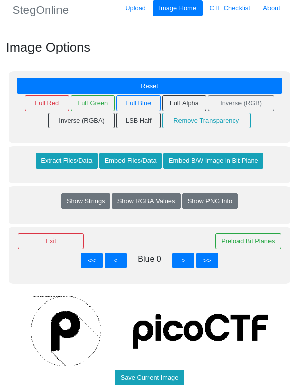

# St3g0

**Category:** Forensics  
**Difficulty:** Medium  
**Platform:** picoCTF 2022  
**Tools:** StegOnline, zsteg  

## Recon

The challenge provides a single PNG file (`pico.flag.png`) containing the picoCTF logo, with a note to download the image and find the flag.

Opening the image normally shows nothing unusual besides the standard logo, so the next step was to inspect it with a steganography tool. I loaded the image into [StegOnline](https://stegonline.georgeom.net/) to explore its color channels and bit planes.



While browsing the bit planes in StegOnline, a faint artifact was visible in the upper-left corner of the image, hinting that data had been embedded in one of the color channel's least significant bits.

## Investigation

To confirm and extract the hidden data programmatically, I ran `zsteg` against the file, which automatically scans common bit-plane/channel combinations for embedded text and files:

```
$ zsteg pico.flag.png
b1,rgb,lsb,xy       .. text: "picoCTF{7h3r3_15_n0_5p00n_a1062667}$t3g0"
b1,abgr,lsb,xy      .. text: "E2A5q4E%uSA"
b2,b,lsb,xy         .. text: "AAPAAQTAAA"
b2,b,msb,xy         .. text: "HWUUUUUU"
b4,r,lsb,xy         .. file: Targa image data (16-273) 65536 x 4097 x 1 ...
b4,g,lsb,xy         .. file: 0420 Alliant virtual executable not stripped
b4,b,lsb,xy         .. file: Targa image data - Map 272 x 17 x 16 ...
b4,bgr,lsb,xy       .. file: Targa image data - Map 273 x 272 x 16 ...
b4,rgba,msb,xy      .. file: Applesoft BASIC program data, first line number 8
```

The very first line (`b1,rgb,lsb,xy`) is the meaningful result: reading the least significant bit of each RGB channel, in x,y pixel order, decodes directly to readable text containing the flag. The other lines are false positives — `zsteg` brute-forces many bit-plane/channel/order combinations and occasionally misinterprets random noise as a known file signature (Targa, Alliant executable, Applesoft BASIC). These can be ignored.

## Extraction

The decoded string was:

```
picoCTF{7h3r3_15_n0_5p00n_a1062667}$t3g0
```

The `$t3g0` suffix is not part of the flag — it's a tool signature/marker left by StegOnline when embedding data via LSB, appended after the actual payload.

**Flag:** `picoCTF{7h3r3_15_n0_5p00n_a1062667}`

## Lessons Learned

- The least significant bit (LSB) of RGB channels is one of the most common places to hide text in image steganography, since altering it is visually imperceptible.
- `zsteg` is an efficient first pass for PNG/BMP steganography — it automatically brute-forces bit-plane, channel, and scan-order combinations rather than requiring each to be tried manually.
- Not all `zsteg` output is meaningful. Many combinations will "match" a known file signature by pure chance when scanning noise; the first/most common combinations (`b1,rgb,lsb,xy`, `b1,bgr,lsb,xy`) are the most likely candidates for genuinely embedded data and should be checked first.
- Some embedding tools (like StegOnline) append their own signature after the hidden payload — don't assume trailing characters are part of the flag without checking the expected `picoCTF{...}` format.
